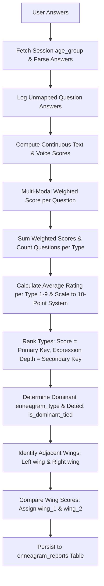

# Enneagram Calculation Logic & Scoring Documentation

This document contains the complete calculation code and mathematical algorithm used to aggregate question answers into `raw_scores` and determine the user's primary `enneagram_type`, dominant wing (`wing_1`), secondary wing (`wing_2`), and genuine tie flag (`is_dominant_tied`).

---

## 1. Algorithmic Overview



---

## 2. Calculation Code (PHP Backend)

The primary calculation function is `calculateAndSaveReport()`, located in [`index.php`](file:///D:/Hochschule/CompanyBased_Internship/enneagram_projects/enneadash_voice/index.php#L120-L270).

```php
<?php
/**
 * Calculates Enneagram raw scores, dominant enneagram_type, wing_1, wing_2, and is_dominant_tied flag from user answers,
 * then saves the result to the enneagram_reports database table.
 *
 * @param PDO $pdo Database connection handle
 * @param int $session_id Exam session ID
 * @param int $user_id User ID
 * @return int|null Report ID on success, null if no answers exist
 */
function calculateAndSaveReport($pdo, $session_id, $user_id) {
    // Ensure required database columns exist
    try {
        $pdo->exec("ALTER TABLE exam_sessions ADD COLUMN age_group VARCHAR(20) DEFAULT NULL");
    } catch (Throwable $e) {}
    try {
        $pdo->exec("ALTER TABLE enneagram_reports ADD COLUMN is_dominant_tied TINYINT(1) DEFAULT 0");
    } catch (Throwable $e) {}

    // 1. Fetch age_group directly from exam_sessions for this assessment session
    $s_stmt = $pdo->prepare("SELECT age_group FROM exam_sessions WHERE id = ?");
    $s_stmt->execute([$session_id]);
    $sess = $s_stmt->fetch();
    $age_group = ($sess && !empty($sess['age_group'])) ? $sess['age_group'] : null;

    // Fallback to user profile if session record does not have age_group set
    if (empty($age_group)) {
        $p_stmt = $pdo->prepare("SELECT age_group FROM user_profiles WHERE user_id = ?");
        $p_stmt->execute([$user_id]);
        $profile = $p_stmt->fetch();
        $age_group = ($profile && !empty($profile['age_group'])) ? $profile['age_group'] : '18-25'; // Fallback

        // Backfill session record
        $up_stmt = $pdo->prepare("UPDATE exam_sessions SET age_group = ? WHERE id = ?");
        $up_stmt->execute([$age_group, $session_id]);
    }

    // 2. Fetch questions for this age group to map target types
    $q_stmt = $pdo->prepare("SELECT id, target_type FROM questions WHERE age_group = ?");
    $q_stmt->execute([$age_group]);
    $questions = [];
    foreach ($q_stmt->fetchAll() as $q) {
        $questions[$q['id']] = $q['target_type'];
    }
    
    // 3. Fetch all recorded answers for this session
    $a_stmt = $pdo->prepare("SELECT question_id, answer_text, input_mode FROM exam_answers WHERE session_id = ?");
    $a_stmt->execute([$session_id]);
    $answers = $a_stmt->fetchAll();
    
    if (empty($answers)) {
        return null;
    }

    // Initialize scoring arrays for Enneagram Types 1 through 9
    $type_weighted_sums     = array_fill(1, 9, 0.0);
    $type_question_counts   = array_fill(1, 9, 0);
    $type_expression_depths = array_fill(1, 9, 0.0);
    
    // 4. Official Enneagram Multi-Modal Weighted Scoring Algorithm
    foreach ($answers as $ans) {
        $q_id = $ans['question_id'];
        $type = $questions[$q_id] ?? null;
        
        // Log answers that fail to map to a target question type
        if (!$type) {
            error_log("Warning: Answer for question_id {$q_id} in session {$session_id} could not be mapped to a target question type (age_group: {$age_group}).");
            continue;
        }

        $decoded = json_decode($ans['answer_text'], true);
        
        $scale_val  = isset($decoded['score']) ? intval($decoded['score']) : 0;
        $text_input  = isset($decoded['text_input']) ? trim($decoded['text_input']) : '';
        $voice_input = isset($decoded['voice_input']) ? trim($decoded['voice_input']) : '';
        
        // Legacy fallback
        if ($text_input === '' && $voice_input === '' && isset($decoded['reason'])) {
            $legacy_reason = trim($decoded['reason']);
            if (($ans['input_mode'] ?? 'text') === 'voice') {
                $voice_input = $legacy_reason;
            } else {
                $text_input = $legacy_reason;
            }
        }
        
        // Evaluate text reasoning score (continuous float 1.0 to 5.0)
        $text_score = 0.0;
        if ($text_input !== '') {
            $words = count(array_filter(preg_split('/\s+/', $text_input)));
            $chars = strlen($text_input);
            $text_score = min(5.0, 1.0 + ($words * 0.25) + ($chars * 0.005));
        }
        
        // Evaluate voice transcript score (continuous float 1.0 to 5.0)
        $voice_score = 0.0;
        if ($voice_input !== '') {
            $words = count(array_filter(preg_split('/\s+/', $voice_input)));
            $chars = strlen($voice_input);
            $voice_score = min(5.0, 1.0 + ($words * 0.3) + ($chars * 0.006));
        }

        // Multi-modal weighted combination
        if ($scale_val > 0 && $text_score > 0 && $voice_score > 0) {
            $q_score = (0.50 * $scale_val) + (0.25 * $text_score) + (0.25 * $voice_score);
        } else if ($scale_val > 0 && ($text_score > 0 || $voice_score > 0)) {
            $qual = max($text_score, $voice_score);
            $q_score = (0.65 * $scale_val) + (0.35 * $qual);
        } else if ($scale_val > 0) {
            $q_score = floatval($scale_val);
        } else if ($text_score > 0 || $voice_score > 0) {
            $q_score = max($text_score, $voice_score);
        } else {
            $q_score = 0.0;
        }

        $type_weighted_sums[$type] += $q_score;
        $type_question_counts[$type]++;
        
        $total_text = trim($text_input . ' ' . $voice_input);
        $type_expression_depths[$type] += (strlen($total_text) * 0.0001);
    }

    // 5. Calculate Average Ratings and Weighted Scores (10-point scale: avg * 2.0)
    // Note: expression depth is NOT added into the stored/persisted score.
    $display_scores = array_fill(1, 9, 0.0);
    $raw_avg_scores = array_fill(1, 9, 0.0);
    
    for ($t = 1; $t <= 9; $t++) {
        $count = $type_question_counts[$t];
        if ($count > 0) {
            $avg = $type_weighted_sums[$t] / $count;
            $raw_avg_scores[$t] = $avg * 2.0;
            $display_scores[$t] = round($avg * 2.0, 2);
        }
    }

    // 6. Rank all 9 types:
    // Primary sort key: display_scores
    // Secondary sort key: type_expression_depths (used ONLY for ranking tie-breaking)
    $types = range(1, 9);
    usort($types, function($a, $b) use ($display_scores, $raw_avg_scores, $type_expression_depths) {
        if ($display_scores[$a] != $display_scores[$b]) {
            return ($display_scores[$a] > $display_scores[$b]) ? -1 : 1;
        }
        if ($type_expression_depths[$a] != $type_expression_depths[$b]) {
            return ($type_expression_depths[$a] > $type_expression_depths[$b]) ? -1 : 1;
        }
        return $a <=> $b;
    });
    $dominant_type = $types[0];

    // 7. Detect genuine tie for dominant type (comparing display_scores)
    $is_dominant_tied = false;
    $dominant_score = $display_scores[$dominant_type];
    if ($dominant_score > 0) {
        foreach ($display_scores as $t => $score) {
            if ($t !== $dominant_type && $score == $dominant_score) {
                $is_dominant_tied = true;
                break;
            }
        }
    }

    // 8. Calculate adjacent wings for dominant type
    $wing1 = ($dominant_type == 1) ? 9 : ($dominant_type - 1);
    $wing2 = ($dominant_type == 9) ? 1 : ($dominant_type + 1);

    $score_w1 = $display_scores[$wing1] ?? 0;
    $score_w2 = $display_scores[$wing2] ?? 0;

    // Dominant wing is the adjacent type with the higher weighted score
    $w1 = ($score_w1 >= $score_w2) ? $wing1 : $wing2;
    $w2 = ($w1 == $wing1) ? $wing2 : $wing1;

    // Final scores to persist in DB (mapped 1..9)
    $final_scores = [];
    for ($t = 1; $t <= 9; $t++) {
        $final_scores[$t] = $display_scores[$t];
    }

    // 9. Save Enneagram report with is_dominant_tied flag
    $stmt = $pdo->prepare("INSERT INTO enneagram_reports (session_id, user_id, enneagram_type, wing_1, wing_2, raw_scores, is_dominant_tied, created_at) 
                           VALUES (?, ?, ?, ?, ?, ?, ?, NOW())");
    $stmt->execute([
        $session_id,
        $user_id,
        $dominant_type,
        $w1,
        $w2,
        json_encode($final_scores),
        $is_dominant_tied ? 1 : 0
    ]);
    $report_id = $pdo->lastInsertId();
    
    // Update session status to completed
    $stmt = $pdo->prepare("UPDATE exam_sessions SET status = 'completed' WHERE id = ?");
    $stmt->execute([$session_id]);

    return $report_id;
}
```

---

## 3. Detailed Mathematical Step Breakdown

### Step A: Multi-Modal Question Score Calculation
For each question answered:
1. **Likert Scale Rating ($S$)**: Integer value $S \in \{1, 2, 3, 4, 5\}$.
2. **Text Reasoning Score ($T$)**:
   $$T = \min\left(5.0, \; 1.0 + (\text{word\_count} \times 0.25) + (\text{char\_count} \times 0.005)\right)$$
3. **Voice Transcript Score ($V$)**:
   $$V = \min\left(5.0, \; 1.0 + (\text{word\_count} \times 0.30) + (\text{char\_count} \times 0.006)\right)$$
4. **Weighted Question Score ($Q_{score}$)**:
   - **All 3 inputs present**: $Q_{score} = 0.50 \cdot S + 0.25 \cdot T + 0.25 \cdot V$
   - **Rating + 1 Text/Voice input**: $Q_{score} = 0.65 \cdot S + 0.35 \cdot \max(T, V)$
   - **Rating scale only**: $Q_{score} = S$
   - **Text or Voice only**: $Q_{score} = \max(T, V)$

### Step B: Type Score Aggregation & 10-Point Scaling
For each Enneagram type $t \in \{1..9\}$:
- **Average Rating ($\bar{A}_t$)**:
  $$\bar{A}_t = \frac{\sum Q_{score, t}}{N_t}$$
- **Stored/Display Score ($R_t$)**:
  $$R_t = \text{round}(\bar{A}_t \times 2.0, 2)$$
- **Expression Depth ($D_t$)** (Used exclusively as a secondary tie-breaker during ranking):
  $$D_t = \sum (\text{total\_chars}_t \times 0.0001)$$

### Step C: Dominant Enneagram Type Selection & Genuine Tie Detection
- Types are ranked primarily by $R_t$ (or $\bar{A}_t \times 2.0$) descending, and secondarily by expression depth $D_t$ descending.
  $$\text{enneagram\_type} = \operatorname*{argmax}_{t \in \{1..9\}} (R_t, D_t)$$
- Genuine tie detection flag (`is_dominant_tied`):
  $$\text{is\_dominant\_tied} = \exists \, t \neq \text{dominant\_type} \text{ such that } R_t = R_{\text{dominant\_type}}$$

### Step D: Wing Determination (`wing_1` & `wing_2`)
The Enneagram circle wraps around ($9 \leftrightarrow 1$), making adjacent types:
- $\text{Left Wing} = (\text{dominant\_type} == 1) \;?\; 9 : (\text{dominant\_type} - 1)$
- $\text{Right Wing} = (\text{dominant\_type} == 9) \;?\; 1 : (\text{dominant\_type} + 1)$

Comparing raw scores $R_{\text{Left}}$ and $R_{\text{Right}}$:
- **Primary Wing (`wing_1`)**: The adjacent wing with the higher score:
  $$\text{wing\_1} = \begin{cases} \text{Left Wing} & \text{if } R_{\text{Left}} \ge R_{\text{Right}} \\ \text{Right Wing} & \text{otherwise} \end{cases}$$
- **Secondary Wing (`wing_2`)**: The remaining adjacent wing:
  $$\text{wing\_2} = \begin{cases} \text{Right Wing} & \text{if } \text{wing\_1} = \text{Left Wing} \\ \text{Left Wing} & \text{otherwise} \end{cases}$$

---

## 4. Summary of Saved Output Schema

| Field Name | Type | Description |
| :--- | :--- | :--- |
| `enneagram_type` | `INTEGER (1-9)` | Primary dominant Enneagram personality type. |
| `wing_1` | `INTEGER (1-9)` | Primary wing (adjacent type with higher score). |
| `wing_2` | `INTEGER (1-9)` | Secondary wing (adjacent type with lower score). |
| `raw_scores` | `JSON Object` | Key-value pairs mapping types `1` through `9` to their calculated 10-point float scores (e.g. `{"1":7.5,"2":8.25,"3":9.10,...}`). |
| `is_dominant_tied` | `BOOLEAN (0/1)` | True (`1`) if another type shared the exact same top score with the dominant type. |
